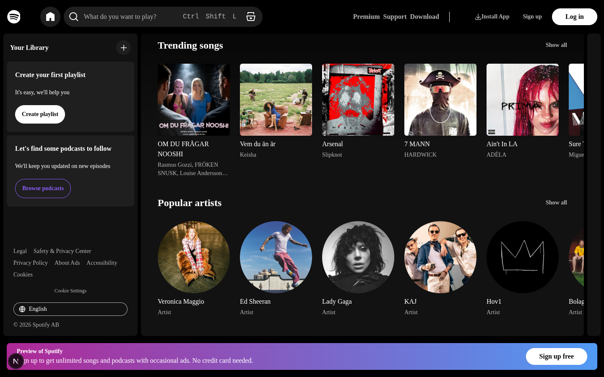
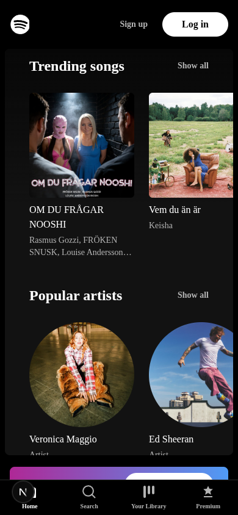

# Spotify Local

A Spotify-inspired client for self-hosted music, built around Navidrome and the OpenSubsonic API.

Spotify Local gives you a familiar music streaming interface while keeping your music library on your own server.



## Features

- Spotify-inspired interface
- Navidrome integration
- OpenSubsonic API support
- Search your music library
- Browse artists, albums, and tracks
- Recommended music
- Recently added media
- Playlist support
- Lyrics support
- Spotify-style lyrics interface
- Responsive desktop and mobile layouts
- Native Linux desktop application
- Arch Linux / Pacman package
- Docker support
- Self-hosted music library
- No Spotify account required

## Screenshots

### Desktop


### Mobile



## Requirements

For using Spotify Local, you need:

- A running Navidrome server
- A Navidrome account
- Your Navidrome server URL

For development, you also need:

- Node.js
- npm

Spotify Local communicates with Navidrome through its OpenSubsonic-compatible API.

Your music files stay on your own server. Spotify Local acts as the client.

## Installation

### Arch Linux

Download the latest Arch Linux package from the GitHub Releases page.

Install it with:

```bash
sudo pacman -U spotify-local-1.0.0-1-x86_64.pkg.tar.zst
